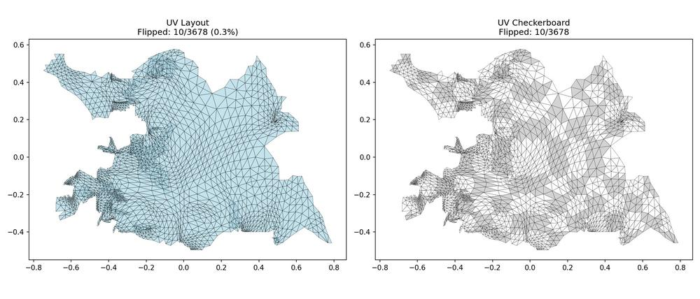
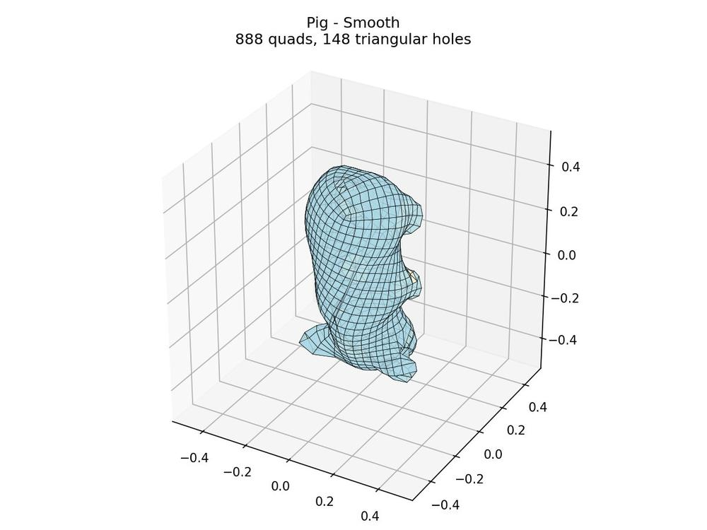

# Rectangular Surface Parameterization (Python)

> **Python implementation** of the algorithm by Etienne Corman and Keenan Crane.
> Original MATLAB code: [etcorman/RectangularSurfaceParameterization](https://github.com/etcorman/RectangularSurfaceParameterization)


This is a complete Python port of the MATLAB implementation for the paper:

[_Rectangular Surface Parameterization_](https://www.cs.cmu.edu/~kmcrane/Projects/RectangularSurfaceParameterization/RectangularSurfaceParameterization.pdf)
Etienne Corman and Keenan Crane
_ACM Transactions on Graphics (SIGGRAPH)_, 2025

## What This Does

Computes an orthogonal (rectangular) UV parameterization of a triangle mesh, aligned to a cross field. The resulting UVs can be used for quad meshing, texture mapping, or architectural/fabrication applications where rectangular grid patterns are desired.

**Key features:**
- Cross field computation (smooth, curvature-aligned, or trivial connection)
- Seamless parameterization with integrability constraints
- Hard edge and boundary alignment support
- Integration with [libQEx](https://github.com/hcebke/libQEx) for quad mesh extraction


*Pig mesh parameterization: 3678 faces, only 10 flipped triangles (0.3%)*


*Extracted quad mesh: 888 quads via libQEx*

## Installation

```bash
# Clone the repository
git clone https://github.com/mfagerlund/rectangular-surface-parameterization.git
cd rectangular-surface-parameterization

# Install dependencies
pip install numpy scipy matplotlib trimesh

# Optional: for mesh preprocessing
pip install pymeshlab
```

## Command-Line Interface

Two main commands are provided:

### `run_RSP.py` - Parameterization

Computes UV parameterization for a triangle mesh.

```bash
python run_RSP.py mesh.obj -o Results/ -v
```

**Options:**
| Option | Default | Description |
|--------|---------|-------------|
| `-o, --output` | `Results/` | Output directory |
| `-v, --verbose` | off | Verbose output |
| `--frame-field` | `smooth` | Cross field type: `smooth`, `curvature`, `trivial` |
| `--energy` | `distortion` | Energy type: `distortion`, `chebyshev`, `alignment` |
| `--w-conf-ar` | `0.5` | Conformal/area weight (0=area, 0.5=isometric, 1=conformal) |
| `--no-hardedge` | off | Disable hard edge constraints |
| `--no-boundary` | off | Disable boundary alignment |
| `--no-seamless` | off | Disable seamlessness constraint |
| `--visualize` | `1,2,3,4,5` | Stages to visualize (use `none` to disable) |
| `--plot` | off | Show interactive matplotlib plots |

**Output:** `<mesh>_param.obj` with UV coordinates

### `extract_quads.py` - Full Pipeline

Runs parameterization + quad mesh extraction via libQEx.

```bash
python extract_quads.py mesh.obj -o Results/ --scale 10
```

**Options:**
| Option | Default | Description |
|--------|---------|-------------|
| `-o, --output` | `Results/` | Output directory |
| `--scale` | `1.0` | UV scale factor (higher = more quads) |
| `--preprocess` | off | Clean mesh with PyMeshLab first |
| `--skip-rsp` | off | Use existing `*_param.obj` file |

**Output:** `<mesh>_quads.obj`

> **Note:** Quad extraction requires libQEx binaries. Windows binaries are included in `bin/`.
> For Linux/macOS, build from source - see `docs/libqex_setup.md`.
> Parameterization works on all platforms without binaries.

See **[USAGE.md](USAGE.md)** for complete reference including troubleshooting and Python API.

See **[EXAMPLES.md](EXAMPLES.md)** for a gallery of all test meshes with different configurations.

## Python Conversion Notes

This is a **line-by-line port** of the original MATLAB implementation by Mattias Fagerlund.
The Python code preserves the exact structure and algorithms of the MATLAB source.

For the original version with interleaved MATLAB comments alongside each Python section,
see [commit 7d1aab4](https://github.com/mfagerlund/rectangular-surface-parameterization/tree/7d1aab4).

**Core port:**
- Complete translation of all MATLAB algorithms to Python/NumPy/SciPy
- All pipeline stages verified with test suites (see `tests/`)

**Validation against MATLAB:** This port has been validated against the original MATLAB code by running it through GNU Octave 10.3.0. All three benchmark meshes (pig, B36, SquareMyles) produce structurally identical results: matching mesh topology, singularity counts, zero flipped triangles, and successful convergence. See [docs/octave-validation-report.md](docs/octave-validation-report.md) for the full report and [tests/test_octave_golden.py](tests/test_octave_golden.py) for automated golden tests.

**Additional pipeline extensions (beyond the original):**
- Mesh preprocessing utilities for handling real-world meshes
- Integration with libQEx for quad mesh extraction
- Visualization and verification tools

For implementation details, see [agents.md](agents.md).

## Citation

If you use this software in academic work, please cite the original paper:

```bibtex
@article{Corman:2025:RSP,
  author = {Corman, Etienne and Crane, Keenan},
  title = {Rectangular Surface Parameterization},
  journal = {ACM Trans. Graph.},
  volume = {44},
  number = {4},
  year = {2025},
  publisher = {ACM},
  address = {New York, NY, USA},
}
```

## License

AGPL-3.0-or-later

Copyright (C) 2025 Etienne Corman and Keenan Crane (original algorithm)
Copyright (C) 2025 Mattias Fagerlund (Python conversion)

See [LICENSE](LICENSE) for full terms. Commercial licensing available from the original authors.

## Acknowledgments

### Rectangular Surface Parameterization
- **Etienne Corman** and **Keenan Crane** for the algorithm and original MATLAB implementation
- **Yoann Coudert-Osmont** for the quantization code

### Quad Mesh Extraction (QEx)
This project includes a Python port of the QEx algorithm for quad mesh extraction:

- **Hans-Christian Ebke**, **David Bommes**, **Marcel Campen**, and **Leif Kobbelt** for the QEx algorithm
- **libQEx**: [github.com/hcebke/libQEx](https://github.com/hcebke/libQEx) (GPL-3.0)

> Ebke et al. 2013. "QEx: Robust Quad Mesh Extraction." *ACM Trans. Graph.* 32(6).
> DOI: [10.1145/2508363.2508372](https://doi.org/10.1145/2508363.2508372)

See [docs/qex_python_port_plan.md](docs/qex_python_port_plan.md) for implementation details.

### Other Dependencies
- **PyMeshLab** for mesh preprocessing and repair
- **OpenMesh** (used by libQEx C++ binaries)
