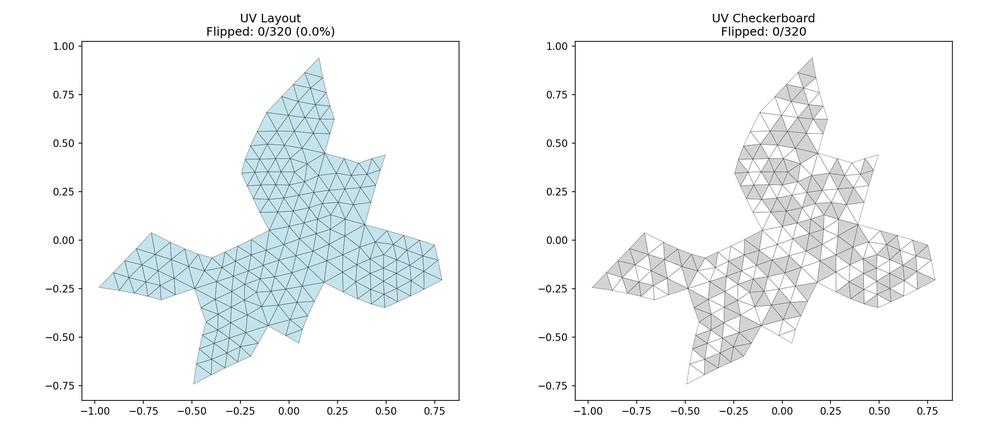
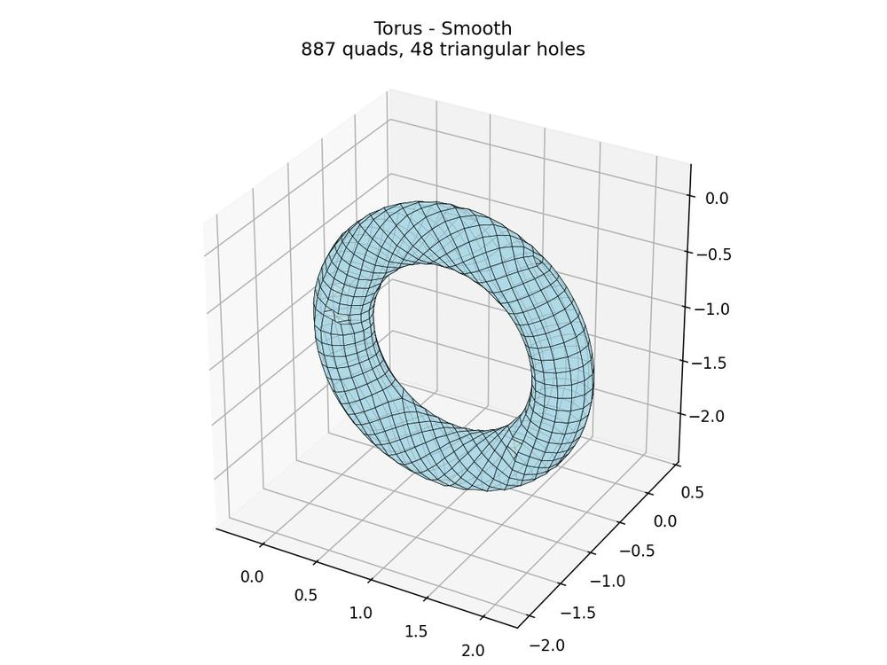
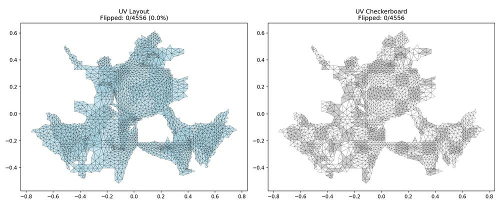
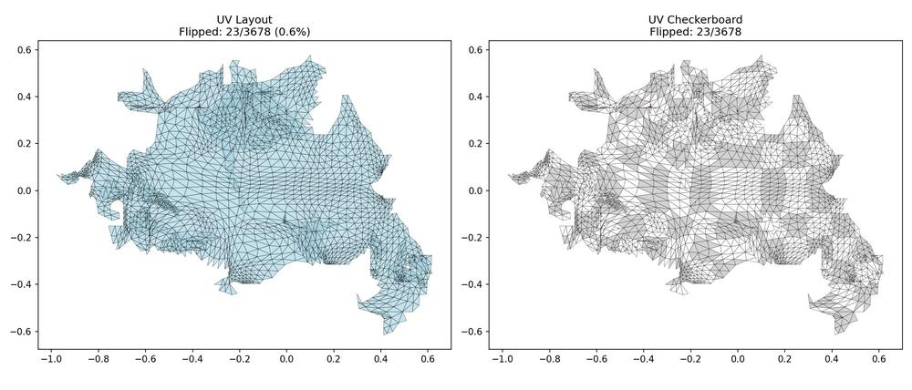
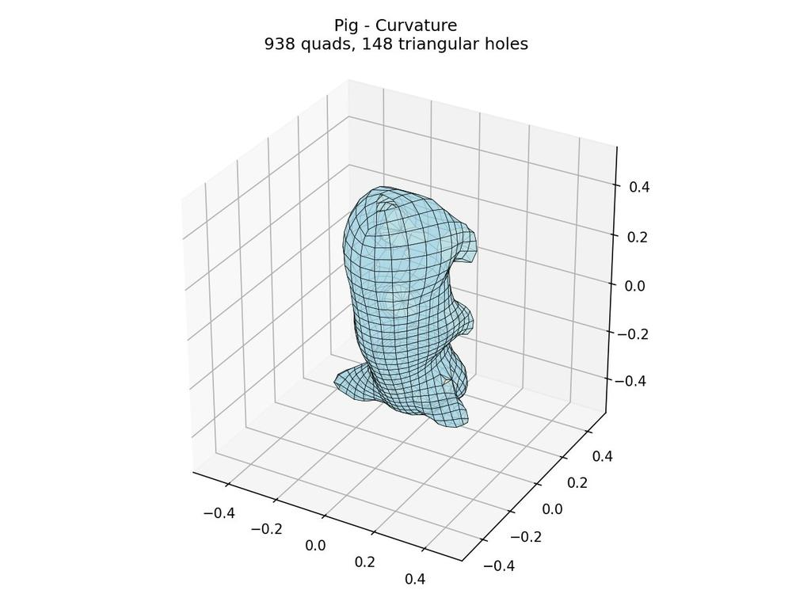
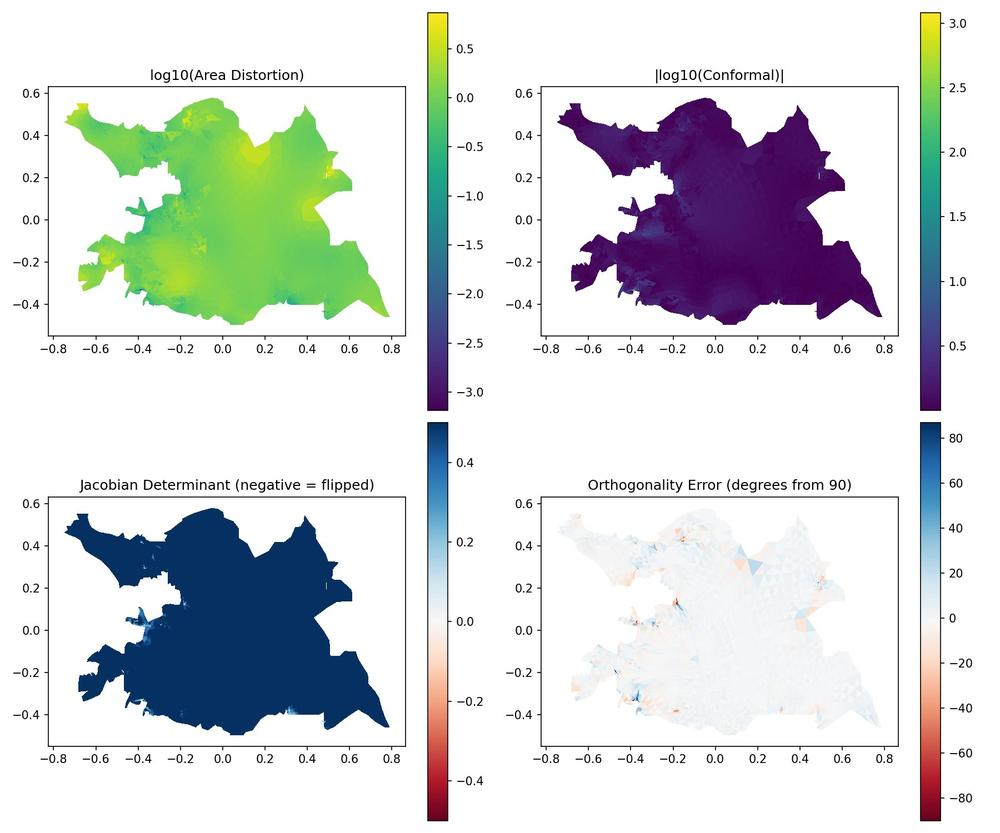
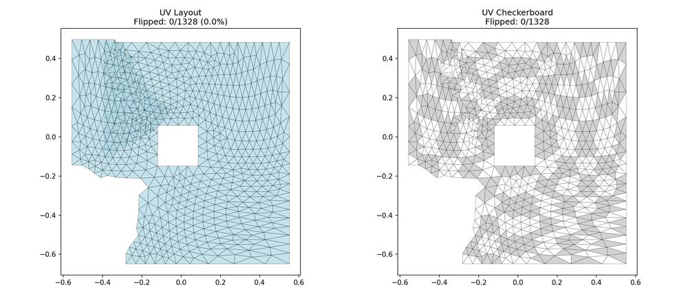
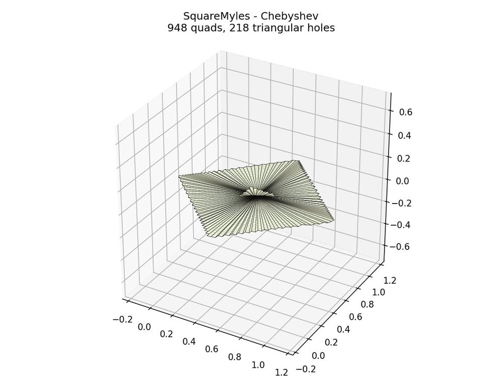

# Usage Guide

Command-line reference for rectangular-surface-parameterization.

## Pipeline Overview

The algorithm transforms a triangle mesh into a quad mesh through these stages:


*Example output: Sphere UV layout with checkerboard visualization*

1. **Cross Field** - Compute a smooth 4-directional field on the surface
2. **Cut Graph** - Find cuts to unfold the mesh to a disk topology
3. **Optimization** - Solve for scale factors that make the field integrable
4. **UV Recovery** - Integrate the field to get UV coordinates
5. **Quad Extraction** - Extract quads from integer UV grid lines (optional, via libQEx)


*Final result: Quad mesh extracted from the parameterization (908 quads)*

### Key Concepts

**Singularities** are points where the cross field cannot be defined smoothly. They appear
where 3 or 5 quads meet instead of the regular 4. The algorithm automatically places
singularities based on the mesh's Gaussian curvature (Euler characteristic constraint).


**Seamlessness** ensures that UV coordinates match up across cuts, allowing the quad grid
to wrap around the surface without visible seams.


## Basic Commands

### Parameterization Only

```bash
# Basic run - outputs parameterized mesh with UVs + all stage visualizations
python run_RSP.py mesh.obj -o Results/ -v

# Disable visualizations (faster)
python run_RSP.py mesh.obj -o Results/ -v --visualize none

# Only specific stages (1=geometry, 2=cross_field, 3=cut_graph, 4=optimization, 5=uv_recovery)
python run_RSP.py mesh.obj -o Results/ -v --visualize 1,5

# Interactive matplotlib plots (in addition to saved PNGs)
python run_RSP.py mesh.obj -o Results/ -v --plot
```

**Output:**
- `Results/<mesh>_param.obj` - Parameterized mesh with UV coordinates
- `Results/stage1_*.jpg` - Geometry visualizations (mesh, curvature)
- `Results/stage2_*.jpg` - Cross field visualizations (streamlines, singularities)
- `Results/stage3_*.jpg` - Cut graph visualization
- `Results/stage4_*.jpg` - Optimization visualizations (scale fields)
- `Results/stage5_*.jpg` - UV recovery visualizations (UV layout, quality)

### Full Pipeline (Parameterization + Quad Extraction)

> **Note:** Quad extraction requires libQEx binaries, which are automatically downloaded
> from GitHub Releases on first use (Windows, Linux, macOS supported).
> See [Other Platforms](#other-platforms) for building from source.

```bash
# Generate quad mesh from triangle mesh
python extract_quads.py mesh.obj -o Results/ --scale 10

# With mesh preprocessing (for problematic meshes)
python extract_quads.py mesh.obj -o Results/ --scale 10 --preprocess

# Skip parameterization if already done
python extract_quads.py mesh.obj -o Results/ --scale 10 --skip-rsp
```

**Output:** `Results/<mesh>_quads.obj`

The `--scale` parameter controls quad density (higher = more quads).


*Torus quad mesh: 887 quads with clean periodic structure*

## Cross Field Options

The cross field determines the orientation of the UV grid on the surface. Different methods
produce different quad layouts.

> **Note on UV overlaps:** The images below may show overlapping regions in UV space. This is
> **expected behavior** - the algorithm produces *seamless* UVs for quad meshing, not *bijective*
> (overlap-free) UVs for texturing. libQEx handles overlaps during quad extraction.

### `--frame-field smooth` (default)

Computes the **smoothest possible** cross field by minimizing directional variation across
the mesh using heat flow diffusion. Good general-purpose choice when you don't need
alignment to surface features.


*B36 mesh with smooth cross field: 0 flipped triangles*

```bash
python run_RSP.py mesh.obj --frame-field smooth
```

### `--frame-field curvature`

Aligns the cross field to **principal curvature directions**. On a cylinder, one direction
follows the axis while the other wraps around. On a saddle, directions follow the curves
of steepest ascent/descent. Best for organic shapes where you want quads to follow the
natural geometry.


*Pig mesh with curvature-aligned cross field*


*Curvature-aligned quad mesh: 938 quads following principal curvature directions*

```bash
python run_RSP.py mesh.obj --frame-field curvature
```

### `--frame-field trivial`

Uses a **trivial connection** where singularities are placed at boundary vertices based on
their Gaussian curvature. Produces a field with minimal internal singularities. Useful for
meshes with boundaries where you want predictable singularity placement.


```bash
python run_RSP.py mesh.obj --frame-field trivial
```

### Cross Field Comparison

See **[EXAMPLES.md](EXAMPLES.md)** for side-by-side comparisons of all cross field methods on various meshes.

## Constraint Options

All constraints are **enabled by default**. Use `--no-*` flags to disable:

```bash
# Disable hard edge alignment (edges auto-detected by dihedral angle)
python run_RSP.py mesh.obj --no-hardedge

# Disable boundary alignment
python run_RSP.py mesh.obj --no-boundary

# Disable seamlessness (not recommended for quad extraction)
python run_RSP.py mesh.obj --no-seamless
```

Disable multiple:
```bash
python run_RSP.py mesh.obj --no-hardedge --no-boundary
```

## Energy Types

The energy type controls what the optimizer tries to achieve. Different energies produce
different trade-offs between angle preservation, area preservation, and alignment.

### `--energy distortion` (default)

Minimizes **metric distortion** - how much the UV mapping stretches or compresses the mesh.
The `--w-conf-ar` parameter controls the trade-off:

| Value | Effect | Use Case |
|-------|--------|----------|
| `0.0` | Area-preserving | Equal-sized quads regardless of 3D shape |
| `0.5` | Isometric (default) | Balance between angles and areas |
| `1.0` | Conformal | Preserve angles, allow area variation |


*Distortion analysis panel: area, conformal, Jacobian, and orthogonality metrics*

```bash
python run_RSP.py mesh.obj --energy distortion --w-conf-ar 0.5
```

### `--energy chebyshev`

Optimizes for **Chebyshev nets** where grid lines maintain constant spacing. Used in
architectural applications and fabric/material simulation where you need a net that can
be physically constructed from inextensible strips.


*SquareMyles with Chebyshev energy: uniform grid spacing*


*Chebyshev quad mesh: 948 quads with constant grid spacing*

```bash
python run_RSP.py mesh.obj --energy chebyshev
```

### `--energy alignment`

Prioritizes **alignment to the cross field directions** over distortion minimization.
Use with `--frame-field curvature` to get quads that strictly follow principal curvatures,
even at the cost of some stretching.


```bash
python run_RSP.py mesh.obj --energy alignment
```

### Energy Comparison

See **[EXAMPLES.md](EXAMPLES.md)** for comparisons of distortion vs Chebyshev energy on the same mesh.

## Mesh Preprocessing

For meshes with quality issues (non-manifold edges, holes, etc.):

```bash
# Standalone preprocessing
python -m rectangular_surface_parameterization.utils.preprocess_mesh input.obj output_clean.obj

# Check mesh quality
python -c "from rectangular_surface_parameterization.utils.preprocess_mesh import check_mesh_quality; check_mesh_quality('mesh.obj')"
```

Or use the `--preprocess` flag with extract_quads.py.

## Verification

Stage visualizations are now generated automatically by `run_RSP.py`:

```bash
# Generate all stage visualizations (default)
python run_RSP.py mesh.obj -o Results/ -v

# Generate only specific stages
python run_RSP.py mesh.obj -o Results/ -v --visualize 1,2  # geometry + cross field only
```

This outputs PNG files for each stage in the output directory.

```bash
# Run all tests
pytest tests/ -v
```

## Output Files

| File | Description |
|------|-------------|
| `<mesh>_param.obj` | Parameterized mesh with UV coordinates |
| `<mesh>_quads.obj` | Extracted quad mesh (from extract_quads.py) |
| `stage5_uv_layout.jpg` | UV space visualization with checkerboard |
| `stage5_quality.jpg` | Distortion heatmap (4 metrics) |

## Test Meshes

Test meshes are included in the `Mesh/` folder. See [Mesh/README.md](Mesh/README.md) for details and **[EXAMPLES.md](EXAMPLES.md)** for output visualizations of all meshes.

```bash
# Simple verification (genus 0)
python run_RSP.py Mesh/sphere320.obj -o Results/ -v

# Torus (genus 1, no singularities)
python run_RSP.py Mesh/torus.obj -o Results/ -v

# Smooth cross field with hard edges (from MATLAB examples)
python run_RSP.py Mesh/B36.obj -o Results/ --frame-field smooth -v

# Curvature-aligned (from MATLAB examples)
python run_RSP.py Mesh/pig.obj -o Results/ --frame-field curvature --energy alignment -v

# Chebyshev net (from MATLAB examples)
python run_RSP.py Mesh/SquareMyles.obj -o Results/ --frame-field trivial --energy chebyshev -v
```

## Troubleshooting

| Issue | Solution |
|-------|----------|
| Singular matrix error | Try `--preprocess` or simplify mesh |
| Flipped triangles (red in viz) | Normal for complex geometry; check if count is acceptable |
| Gaussian curvature mismatch | Mesh may have holes; needs boundary support |
| Non-manifold edges | Use `--preprocess` to clean mesh |

## Python API

```python
from run_RSP import run_rsp_pipeline

# Run parameterization
result = run_rsp_pipeline(
    mesh_path="mesh.obj",
    output_dir="Results/",
    frame_field_type="curvature",
    energy_type="distortion",
    hard_edges=True,
    boundary=True,
    seamless=True
)

# Access results
uv_coords = result.Xp        # (n_vertices, 2)
triangles = result.T         # (n_faces, 3)
flip_count = result.n_flips  # Number of flipped triangles
```

## Other Platforms

### Current Status

The **parameterization** (`run_RSP.py`) works on all platforms (Windows, Linux, macOS) -
it's pure Python with NumPy/SciPy.

**Quad extraction** (`extract_quads.py`) also works on all platforms. Pre-built libQEx
binaries are automatically downloaded from GitHub Releases on first use:
- Windows x64
- Linux x64
- macOS Intel (x64)
- macOS Apple Silicon (ARM64)

If automatic download fails, you can build from source (see below).

### Building libQEx from Source

libQEx is open source and can be built from source:

**Requirements:**
- CMake 3.10+
- C++ compiler (g++ on Linux, clang on macOS)
- OpenMesh library

**Build steps:**
```bash
# Clone dependencies
git clone https://gitlab.vci.rwth-aachen.de:9000/OpenMesh/OpenMesh.git
git clone https://github.com/hcebke/libQEx.git

# Build OpenMesh
cd OpenMesh && mkdir build && cd build
cmake .. -DCMAKE_BUILD_TYPE=Release -DBUILD_APPS=OFF
make -j4
sudo make install
cd ../..

# Build libQEx
cd libQEx && mkdir build && cd build
cmake .. -DCMAKE_BUILD_TYPE=Release
make -j4

# Copy binary to repo
cp qex_extract /path/to/rectangular-surface-parameterization/bin/
```

See `docs/libqex_setup.md` for detailed instructions.

### CI-Built Binaries

Binaries for all platforms are built automatically via GitHub Actions when a new release
tag is created. See `.github/workflows/build-libqex.yml` for the build configuration.
The workflow builds from the latest commits of libQEx and OpenMesh and records the
exact commit hashes in the run summary for GPL compliance.
