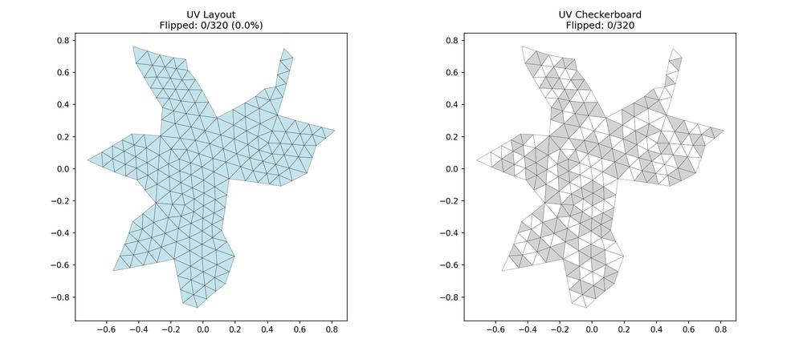
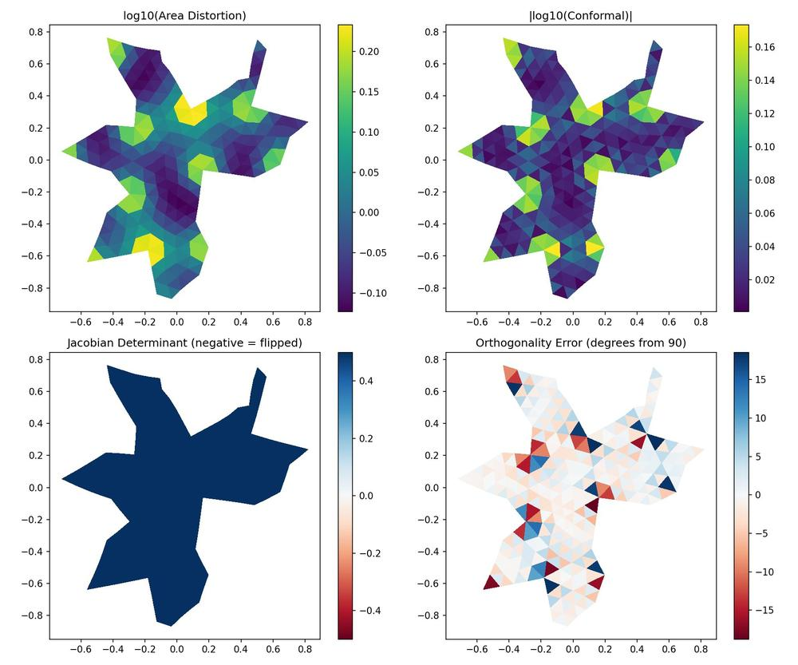
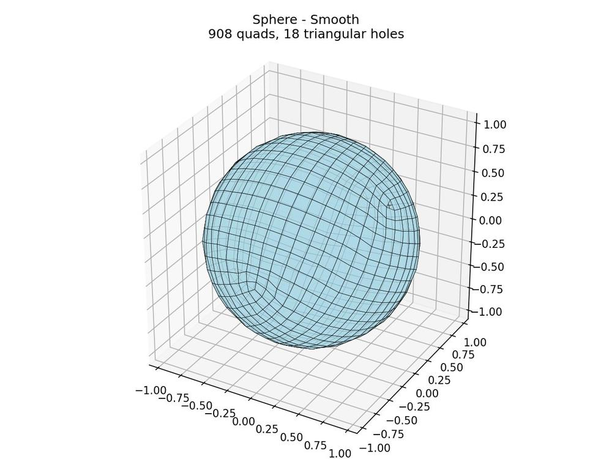
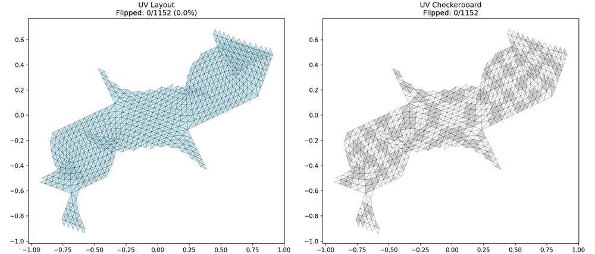

# CLAUDE.md

## Overview / Goal
- Corman & Crane rectangular parameterization (SIGGRAPH 2025) for quad meshing.
- Orthogonal (not necessarily isotropic) UVs aligned to a cross field.
- Not origami unfolding: need **compact** UVs (high fill) so integer iso-lines become quad edges.
- Goal: 0 flipped triangles + compact UV layout.

## Pipeline
Stages: `Geometry -> Cross Field -> Cut Graph -> Optimization -> UV Recovery -> [Quad Extraction]`
Phases: Load mesh -> geometry -> cross field -> cut graph -> sparse ops -> optimization -> UV recovery -> (optional) quad mesh.

**Note:** The Corman-Crane paper covers stages 1-5 (producing seamless UV parameterization). Quad extraction (stage 6) is a separate downstream step, included here for completeness.

## Implementation - `run_RSP.py`
Entry point. Line-by-line translation from official MATLAB code.
- `rectangular_surface_parameterization/preprocessing/` - MeshInfo, angles, curvature, connectivity, DEC operators
- `rectangular_surface_parameterization/cross_field/` - trivial connection, cross field computation
- `rectangular_surface_parameterization/optimization/` - reduce_corner_var_2d, optimize_RSP
- `rectangular_surface_parameterization/parameterization/` - cut_mesh, mesh_to_disk_seamless, parametrization_from_scales
- `rectangular_surface_parameterization/io/` - I/O
- `rectangular_surface_parameterization/utils/` - visualization, preprocessing

## Requirements
Python 3.8+, NumPy, SciPy, Matplotlib, trimesh. Install: `pip install numpy scipy matplotlib trimesh`

Optional for mesh preprocessing: `pip install pymeshlab`

## Commands

See **[USAGE.md](USAGE.md)** for complete CLI reference.

Quick examples:
```bash
python run_RSP.py mesh.obj -o Results/ -v          # Parameterization
python extract_quads.py mesh.obj -o Results/ --scale 10  # Full pipeline
pytest tests/ -v                                    # Run tests
```

Test meshes included in `Mesh/` folder - see [Mesh/README.md](Mesh/README.md) for details.

## Example Output

### Sphere (genus 0) - UV Layout

*Left: UV layout with triangle mesh. Right: Checkerboard pattern for distortion visualization. **0 flipped triangles.***

### Sphere - Distortion Analysis

*Four quality metrics: Area distortion, conformal distortion, Jacobian determinant (negative = flipped), orthogonality error.*

### Sphere - Quad Mesh

*Extracted quad mesh: 908 quads*

### Torus (genus 1) - UV Layout

*Torus parameterization showing characteristic cut structure for genus-1 surface. **0 flipped triangles.***

## References
- MATLAB implementation: https://github.com/etcorman/RectangularSurfaceParameterization
- Paper: https://www.cs.cmu.edu/~kmcrane/Projects/RectangularSurfaceParameterization/
- Quad extraction (libQEx): https://github.com/hcebke/libQEx

## Visualization Utilities
`rectangular_surface_parameterization/io/visualize.py`:
- `plot_uv_with_flips(Xp, T, detJ)` - UV layout with flipped triangles in red
- `plot_uv_checkerboard(Xp, T, detJ)` - checkerboard pattern, flips in red
- `plot_mesh_with_flips(X, T, detJ)` - 3D mesh with flipped faces highlighted
- `save_uv_visualization(Xp, T, detJ, path)` - save 2-panel PNG
- `visualize_run_RSP_result(Src, SrcCut, Xp, disto, output_dir)` - full visualization suite
- `compute_uv_quality(Xp, T, X, T_orig)` - quality metrics (flip count, angle error)

## Current Status
| Stage | Status |
|-------|--------|
| 1. Geometry | VERIFIED (54 pytest tests pass) |
| 2. Cross Field | VERIFIED (8 singularities, sum=chi, matches MATLAB) |
| 3. Cut Graph | VERIFIED (41 cut edges, 7 tests pass) |
| 4. Optimization | VERIFIED (normalization bug fixed, 2 tests pass) |
| 5. UV Recovery | VERIFIED (**0 flips** - rotation matrix bug fixed) |

**ALL STAGES VERIFIED.** Pipeline produces 0 flipped triangles. See [Validation Approach](#validation-approach) below.

## Visual Verification

Stage visualizations are generated automatically by `run_RSP.py`:

```bash
python run_RSP.py mesh.obj -o output/ -v                    # All stages (default)
python run_RSP.py mesh.obj -o output/ -v --visualize 1,5    # Only geometry + UV
python run_RSP.py mesh.obj -o output/ -v --visualize none   # No visualizations
```

| Stage | Output Files | What to Check |
|-------|--------------|---------------|
| 1. Geometry | `stage1_mesh.jpg`, `stage1_curvature.jpg` | Mesh intact, curvature at vertices |
| 2. Cross Field | `stage2_cross_field.jpg`, `stage2_singularities.jpg` | Crosses aligned, 8 singularities for sphere |
| 3. Cut Graph | `stage3_cut_graph.jpg` | Cut edges connect all cones |
| 4. Optimization | `stage4_scales.jpg`, `stage4_distributions.jpg` | Smooth scale fields |
| 5. UV Recovery | `stage5_uv_layout.jpg`, `stage5_quality.jpg` | 0 flipped triangles (no red) |

## Validation Approach

**Important:** This implementation was **not benchmarked against the original MATLAB code** - we never had access to MATLAB. What we did instead:

1. **Extensive test suites**: 54+ pytest tests covering all pipeline stages (geometry, cross field, cut graph, optimization, UV recovery)
2. **Visual verification**: Generated parameterizations match expected behavior - proper UV layouts, correct singularity counts (8 for sphere = Euler characteristic × 4), connected cut graphs
3. **Quality metrics**: Example outputs produce 0 flipped triangles on test meshes, indicating correct algorithm implementation
4. **Code structure verification**: Line-by-line translation preserving the exact structure of the published MATLAB source

See [README.md](README.md) for example outputs and the `tests/` directory for the full test suite.

## Quad Extraction (Beyond Paper)

The Corman-Crane paper produces a **seamless UV parameterization** - the input for quad meshing, not the quad mesh itself. To extract actual quads, two additional steps are needed:

### Full Pipeline: `extract_quads.py`
Runs RSP parameterization + libQEx quad extraction in one command:
```bash
python extract_quads.py mesh.obj -o Results/ --scale 10 -v
```
Options:
- `--scale N` - Scale UVs to control quad density (higher = more quads)
- `--preprocess` - Clean mesh with PyMeshLab before RSP (for problematic meshes)
- `--skip-rsp` - Use existing `*_param.obj` file

Output: `Results/<mesh>_quads.obj`

**Note:** Triangular holes at singularities are expected (where cross field has +90° or -90° rotation).

### 1. Quantization
Move singularities to integer UV coordinates. The MATLAB reference uses an external C++ tool (`QuantizationYoann/`) which is not ported.

### 2. Quad Extraction with libQEx
We use [libQEx](https://github.com/hcebke/libQEx) (GPL, SIGGRAPH Asia 2013) for robust quad mesh extraction from integer-grid maps.

**Pre-built binaries** are included in `bin/` (Windows x64 only). No build required.

To build from source (optional):
- CMake 2.6+, Visual Studio with SSE support
- [OpenMesh](https://www.graphics.rwth-aachen.de/software/openmesh/) library
- See `docs/libqex_setup.md`

**References:**
- libQEx paper: [QEx: Robust Quad Mesh Extraction](https://dl.acm.org/doi/10.1145/2508363.2508372)
- Algorithm details: `docs/algo_integer_grid_maps.md`

## Mesh Preprocessing

Many real-world meshes fail the RSP pipeline due to quality issues. Use the preprocessing utilities:

```python
from rectangular_surface_parameterization.utils.preprocess_mesh import preprocess_mesh, check_mesh_quality

# Diagnose issues
check_mesh_quality("mesh.obj")

# Clean mesh (remesh, fill holes, fix non-manifold)
preprocess_mesh("mesh.obj", "mesh_clean.obj")
```

Or use `--preprocess` flag with `extract_quads.py`.

### Robustness Fixes
The pipeline includes fixes for common mesh issues:
- **Unreferenced vertices**: Handled in `preprocessing/dec.py` (assigns small Voronoi area)
- **Curvature mismatches**: Relaxed to warnings in `preprocessing/preprocess.py`
- **Invalid quad indices**: Filtered in `utils/libqex_wrapper.py`

See `docs/robustness-improvements.md` for details.

## Docs
`docs/algo_integer_grid_maps.md`, `docs/libqex_setup.md`, `docs/robustness-improvements.md`, `docs/mesh-quality-investigation.md`

## Future Work

### Medium Priority
- **Port quantization**: MATLAB uses `QuantizationYoann/` (C++ Gurobi) to snap singularities to integer UVs
- **Auto-detect preprocessing needs**: Check mesh quality and auto-preprocess if needed

### Lower Priority
- **Boundary support**: Handle meshes with holes (teapot fails on Gaussian curvature check)
- **Mixed Voronoi/barycentric areas**: True mixed area computation for obtuse triangles
- **Alternative quantization**: Integer optimization without Gurobi dependency
- **Mesh decimation**: Auto-simplify very large meshes before processing

### Known Limitations
| Mesh | Issue | Workaround |
|------|-------|------------|
| teapot | Meshes with holes | Needs boundary support |
| suzanne | Non-manifold edges | Use --preprocess |

## License

AGPL-3.0-or-later (GNU Affero General Public License v3.0 or later)

This is a derivative work of the original MATLAB implementation by Etienne Corman
and Keenan Crane. See LICENSE file for full attribution and terms.

